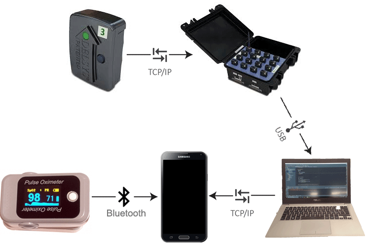

# BSc-Thesis - Muscle Activity Feedback And Visualization
The thesis can be found here: [Link](https://www.dropbox.com/s/ikotbo4zm7339es/Report.pdf?dl=0)

##Abstract
This project aims to create an application to serve as a training partner, substituting or
supplementing a personal trainer, by visualizing how the user’s muscles function and
perform during exercise, and provide relevant feedback.

To achieve this the application record and processes data from EMG and heart rate sensors
connected to the user, and visualise the information in an intuitive fashion, for anyone to
understand on a mobile device.

## Setup
A laptop works as the server, gathering the information from the Trigno base station. The mobile application received and processes the information from the server and bluetooth heart beat sensor.

